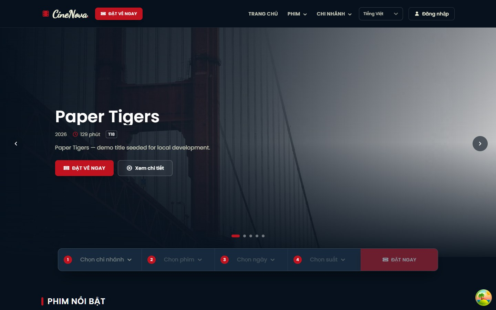
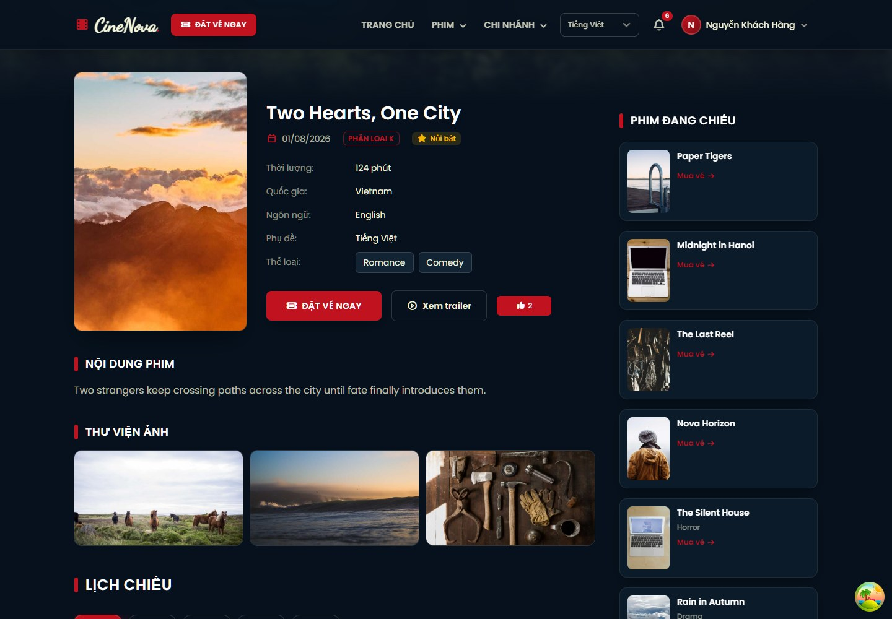
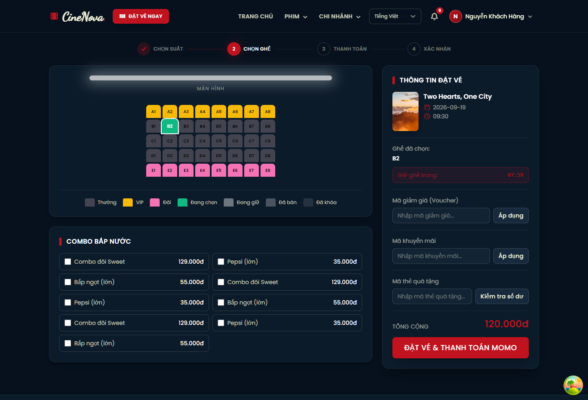
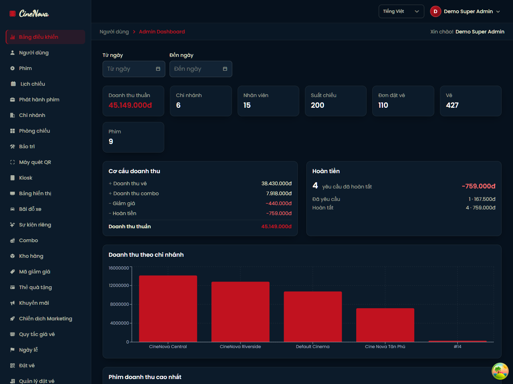
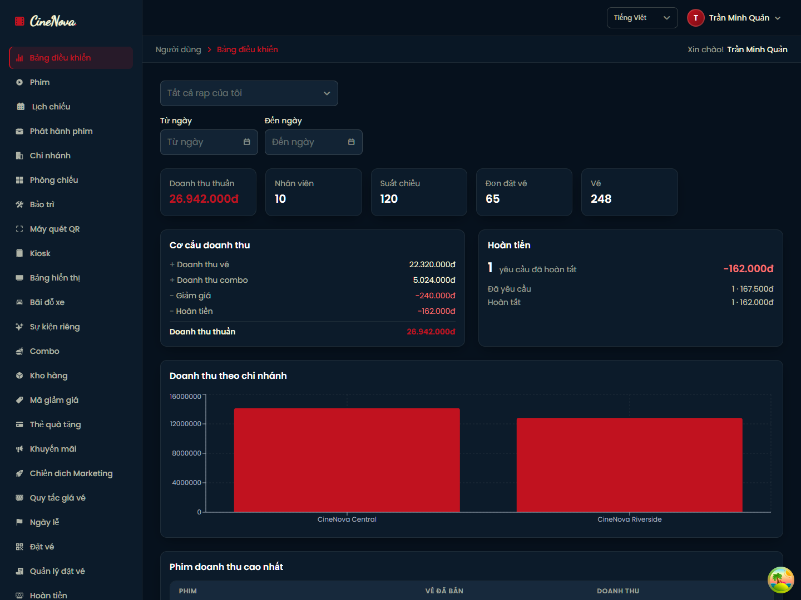
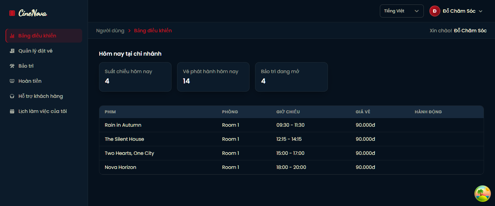
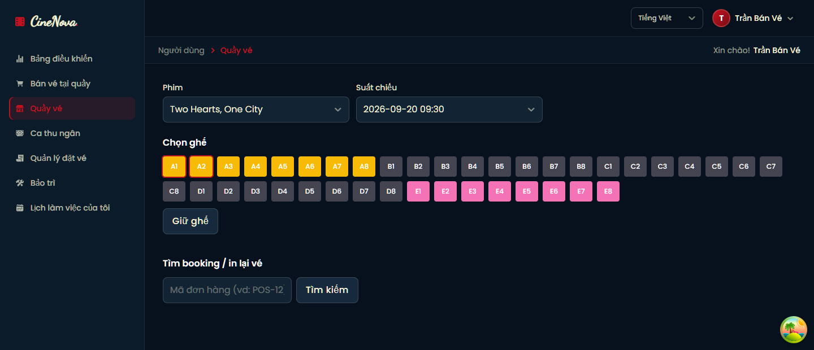
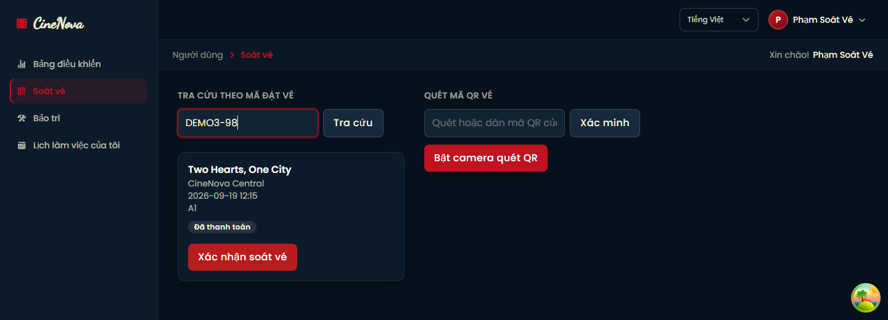
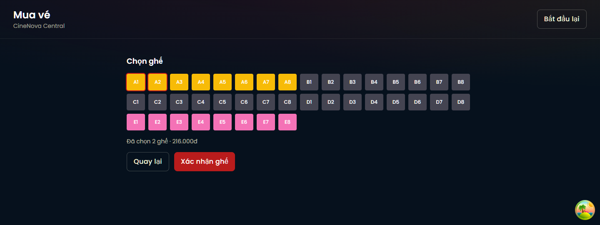
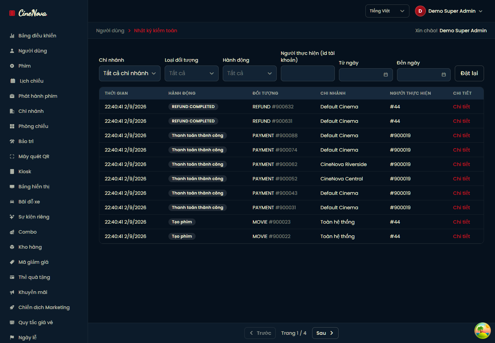

# Movie Booking (Cinema)

A full-stack movie ticket booking platform for a **multi-branch cinema chain**: a public site for customers to browse movies and book seats, plus an internal back office for cinema companies, branch admins, and on-site staff — all driven by a permission-based RBAC system.

- **cinema-be**: Node.js + Express + MongoDB (Mongoose), JWT auth (access + refresh cookie), Socket.IO realtime, MoMo payment integration, Cloudinary image hosting, Nodemailer OTP emails.
- **cinema-fe**: React 18 + TypeScript + Vite, Redux Toolkit + TanStack Query, Tailwind, i18next (10 languages), Formik + Zod forms.

> This document describes the **actual current UX/behavior** of the app (routes, permissions, screens) as implemented in the code — not a spec. See [`cinema-be/src/seed/seedRbac.js`](cinema-be/src/seed/seedRbac.js) and [`cinema-be/src/seed/seedPositions.js`](cinema-be/src/seed/seedPositions.js) for the source of truth on permissions.

---

## Screenshots

Captured from the running app against seeded data — every number, table row and seat below is real.

| | |
|---|---|
| <br>**Home** — featured rail, now-playing and campaign banners, 10-language switcher. | <br>**Movie detail** — banner, gallery, age rating, language/subtitle, reviews gated by real attendance (§6.33). |
| <br>**Seat selection** — Standard/VIP/Couple grid, combos, voucher/promotion/gift-card fields, and the hold countdown driven by the `BOOKING_HOLD_TIME` setting (§6.13). Prices come from the pricing engine, never the client (§6.18). | <br>**Super Admin dashboard** — platform-wide net revenue computed as ticket + combo − discounts − refunds from actual Payment/Refund rows (§6.9). |
| <br>**Branch Admin dashboard** — same reporting components, scoped to the branches this account owns, plus the full back-office sidebar (§6.4). | <br>**Employee dashboard (Customer Service)** — the menu is derived from the permissions this Position actually holds, not a fixed role menu (§5.3, §6.5). |
| <br>**Box Office / POS** — counter sale: movie → showtime → seat hold → payment, with server-side repricing and an idempotent sell endpoint (§6.14). | <br>**Door check-in** — look a ticket up by code or QR; every attempt is logged with a reason code, and a ticket from another branch is rejected (§6.8). |
| <br>**Self-service kiosk** — authenticated by an `X-Kiosk-Key` header instead of a login, reusing the same seat-lock/pricing/booking pipeline (§6.24). | <br>**Audit log** — append-only trail of every consequential write; the schema itself refuses updates and deletes (§6.10). |

---

## 1. Prerequisites

- Node.js >= 18 (20.x recommended)
- npm (backend) and Yarn 3.x / Berry (frontend, via `.yarnrc.yml`)
- A running MongoDB instance (local or MongoDB Atlas)

## 2. Install & run the Backend (`cinema-be`)

```bash
cd cinema-be
npm install
cp .env.example .env
```

Fill in `.env` (Mongo URI, JWT secrets, CORS origin, Cloudinary, SMTP, MoMo — see [`cinema-be/.env.example`](cinema-be/.env.example)).

```bash
npm run dev     # dev mode, auto-reload
npm start        # production mode
npm run seed     # optional: seed sample movies/cinemas + RBAC roles/permissions/positions
npm test         # backend test suite (Jest)
```

The API runs by default at `http://127.0.0.1:8000/api`. `GET /health` is a liveness check.

## 3. Install & run the Frontend (`cinema-fe`)

```bash
cd cinema-fe
yarn install
cp .env.example .env   # set VITE_API_BASE_URL to the backend API URL
yarn dev
```

The frontend runs by default at `http://localhost:3000` (see `vite.config.ts`). `cinema-be`'s `CORS_ORIGIN` must match it.

```bash
yarn build && yarn preview   # production build
yarn test                     # frontend test suite (Vitest)
```

## 4. Running both together

```bash
# Terminal 1
cd cinema-be && npm run dev
```

```bash
# Terminal 2
cd cinema-fe && yarn dev
```

---

## 5. System overview

### 5.1 Org model

```
Company  ──1:N──▶  Branch (a.k.a. "Cinema")  ──1:N──▶  Room  ──1:N──▶  Seat
                         │
                         ├──1:N──▶ Schedule (showtime) ──1:N──▶ Ticket
                         ├──1:N──▶ Employee (staff account + Position)
                         ├──1:N──▶ Combo (concessions), Voucher
                         └── owned by one Account (the "Branch Admin")
```

- A **Company** is the legal entity that owns one or more **Branches**. Only Super Admin manages companies.
- A **Branch** ("cinema") is a physical theater location with rooms, seats, showtimes, staff, combos and vouchers. Each branch has exactly one **owner account** (Branch Admin).
- **Movies, Actors, Directors, Categories** are a shared catalog, not owned by any branch — any branch can schedule any movie.
- A **Booking** = one or more **Tickets** (seats) for a **Schedule**, optionally with **Combos** and a **Voucher**, paid via MoMo (online) or cash (staff counter sale), producing an **Invoice**.

### 5.2 Accounts & roles

Every account has one numeric `role` (stored in the JWT):

| Role | Code | Who |
|---|---|---|
| `0` | **Super Admin** | Platform operator — manages the whole system |
| `1` | **Customer** | Public end-user who books tickets |
| `2` | **Branch Admin** ("Owner") | Manages one or more branches on behalf of a Company |
| `3` | **Employee** | On-site staff at one branch, with a **Position** (Ticket Staff, Cashier, Concession Staff, Check-in Staff, Usher, Customer Service, Security, F&B Staff, Cleaning Staff, Maintenance Staff) that determines exactly what they can do |

### 5.3 Permission model (RBAC)

Authorization is **not** hardcoded per role in the routes — every protected route is gated by `requirePermission('<module>.<action>')` (see [`cinema-be/src/middleware/permission.js`](cinema-be/src/middleware/permission.js)):

1. The account's `role` resolves to a `Role` document (`SUPER_ADMIN` / `CUSTOMER` / `BRANCH_ADMIN` / `EMPLOYEE`).
2. `RolePermission` looks up whether that role has the requested permission code, and its **scope**: `ALL` (any branch) or `BRANCH` (own branch(es) only) or `OWN` (own records only).
3. For an `EMPLOYEE` with no direct role permission, the middleware falls back to the account's **Position** (`Employee.position_id` → `PositionPermission`) — so two employees at the same branch can have different capabilities depending on whether they're a Cashier, Check-in Staff, etc.
4. `requireBranchAccess` / `requireBranchOwnership` additionally enforce that a `BRANCH`-scoped user can only touch **their own branch's** data (Super Admin bypasses this).

The frontend mirrors this: `GET /api/user/permissions` returns the caller's resolved permission codes, consumed via the [`usePermissions()`](cinema-fe/src/hooks/usePermissions.ts) hook to conditionally render nav items/buttons (e.g. an Employee only sees "Counter Sale" if they have `booking.create`, and "Check-in" if they have `ticket.checkin`). Coarser page-level guarding uses [`RequireRole`](cinema-fe/src/app/RequireRole.tsx) with role groups from [`constants/roles.ts`](cinema-fe/src/constants/roles.ts):

- `ADMIN_ONLY_ROLES` = `[Super Admin]`
- `MANAGEMENT_ROLES` = `[Super Admin, Branch Admin]`
- `EMPLOYEE_ONLY_ROLES` = `[Employee]`
- `STAFF_ROLES` = `[Super Admin, Branch Admin, Employee]`

### 5.4 Feature map by role

A fast scan of "what can each role actually do" — see §6 below for the full walkthrough of every item.

| Role | What they can do |
|---|---|
| **Customer** | Browse/search movies & cinemas; book & pay for tickets (MoMo or gift card); rate & review movies/cinemas they've actually attended; manage profile, membership tier & loyalty points; redeem gift cards; request a private cinema rental; track payment history and refund requests; get notified of booking/payment/showtime events |
| **Super Admin** | Everything, system-wide: movie catalog (incl. distributors & release windows), schedules, companies & branches, actors/directors, users, system-wide transactions/payments, review moderation, promotions & notification templates, external integrations & webhooks, global system configuration, platform-wide reporting |
| **Branch Admin ("Owner")** | Everything scoped to the branch(es) they own: rooms/seat maps, combos & inventory, vouchers/promotions/campaigns, dynamic pricing rules & holidays, employees & shift scheduling, kiosks, digital signage, parking, QR check-in devices, maintenance, support tickets, private-event requests, audit log, branch-level system config, branch reporting |
| **Employee** (capability set by Position — §6.5) | Whichever of: selling tickets (Box Office / Counter Sale), fulfilling combo orders, door check-in, opening/closing a cashier shift, handling customer-support tickets, requesting refunds, or working a maintenance ticket — their Position grants |

---

## 6. End-to-end flows

### 6.1 Registration & login (Customer)

1. **Register** (`/Register`) → email + password → backend checks the email isn't taken → account created **unverified** and an OTP is emailed.
2. **Verify** (`/verifycode`) → 6-digit OTP (with resend) → account activated.
3. **Complete profile** (`/UserInfo`) → name/phone saved.
4. **Login** (`/Login`) → `POST /api/Login` issues a short-lived **access token** (returned to the client, kept in Redux + localStorage) and a long-lived **refresh token** (httpOnly cookie). `POST /api/refresh-token` silently renews the access token; `POST /api/logout` clears the cookie.
5. Forgot/([`/ForgotPassword`](cinema-fe/src/features/auth/pages/ForgotPasswordPage.tsx)) → OTP email → **Reset password** (`/ResetPassword`). Logged-in users can also **Change password** (`/ChangePassword`).
6. **Profile** (`/Profile`) — view/edit name, phone, avatar.

### 6.2 Booking a ticket (Customer)

1. Browse: **Home**, **Playing now** (`/Playing`), **Upcoming** (`/Upcoming`), **Cinemas** (`/Cinemas`), movie detail (`/Detail/:id`), branch detail (`/Cinema/:id`) — filter by search/category/country/date/branch. Like a movie (♥) and favorite a branch while browsing.
2. **Movie detail** → reviews & star ratings (create/edit own review, reply, react 👍/❤️, report someone else's) and actor/director cast info.
3. Click **Book Now** on a movie → `/BookTicket/:id` — pick a date, then an available showtime for that date (login required; redirected to `/Login` otherwise).
4. → `/BookSeat` — interactive seat grid (Standard/VIP/Couple), select seat(s), optionally add **Combos** (popcorn/drinks) and apply a **Voucher** code (validated live, discount previewed). Every seat's price comes from the backend's Pricing Rule engine (branch/room type/seat type/movie category/day type/holiday/showtime/membership) — the frontend never computes it.
5. **Checkout** via MoMo — creates a pending invoice, redirects to MoMo, and on return (`/PaymentResult`) confirms/finalizes the booking (also confirmed asynchronously via MoMo's IPN webhook). A QR code (ticket code) is generated for check-in.
6. **My Bookings** (`/MyBookings`) — booking history, ticket QR/print, **cancel** a booking (only allowed if the showtime is more than 2 hours away).
7. Rest of the customer account area: **My Tickets** (`/MyTickets`) & ticket detail (`/Ticket/:id`), **Payment History** (`/PaymentHistory`), **My Refunds** (`/MyRefunds`, §6.22), **My Membership** (`/MyMembership`, §6.17), **My Gift Cards** (`/MyGiftCards`, §6.16), **My Activity** (`/MyActivity`, §6.29), and requesting a **Private Event** rental (`/PrivateEvents/Request`, tracked at `/PrivateEvents`, §6.27).

### 6.3 Super Admin — platform management (`/AdminDashboard` + sidebar)

Everything below is Super-Admin-only (`user.*`, `branch.*`, `company.*`, `movie.*`, `actor.*`, `director.*`, `review.moderate`, `booking.admin`, `report.viewFinancial`, …):

- **Dashboard** (`/AdminDashboard`) — system-wide revenue, ticket sales, occupancy charts, powered by the Reporting module described in §6.9 (`report.viewFinancial`, scope `ALL`).
- **Users** (`/ShowUser`) — list/search all accounts; **block/unblock**, **delete**, **approve** pending staff accounts, reassign a user's role.
- **Movies** (`/Show`) — full CRUD (poster/trailer upload to Cloudinary), assign categories/actors/directors.
- **Schedules** (`/ShowSchedule`) — showtimes across every branch (create/update/cancel/delete).
- **Cinemas/Branches** (`/AdminCinemas`) — approve a pending branch, block/delete a branch, and create a **Branch Admin** account for a company (spins up the branch's owner login in one step).
- **Companies** — create/update/delete the parent legal entities that own branches (`company.*` permissions; no dedicated nav item is wired up in the current sidebar, but the API/back office concept is fully implemented).
- **Actors** (`/AdminActors`) / **Directors** (`/AdminDirectors`) — shared catalog CRUD.
- **Distribution** (`/Distribution`) — manage Distributors and their Movie Release windows per branch (§6.30).
- **Transactions** (`/AdminTransactions`) — every invoice system-wide, with **refund** (reopens the seat).
- **Payments** (`/AdminPayments`) — every payment platform-wide by status/method (§6.23).
- **Reviews** (`/AdminReviews`) — moderate (hide) any review/reply across the platform.
- **Integrations** (`/Integrations`) — external integration registry + inbound webhook delivery log (§6.31), Super-Admin-only.

### 6.4 Branch Admin — "Owner" back office (`/OwnerDashboard` + sidebar)

A Branch Admin manages the branch(es) they own (branch-scoped everywhere via `requireBranchOwnership`):

- **Dashboard** (`/OwnerDashboard`) — revenue/tickets/occupancy for their own branch(es), via the Reporting module (§6.9).
- **Movies / Schedules** — same screens as admin, but scoped to movies they added / showtimes at their branches.
- **Cinemas** (`/OwnerCinemas`) — their branch(es) and status (pending/active/disabled/maintenance); edit branch contact/operating info.
- **Rooms** (`/OwnerCinemas/:branchId/Rooms`) — create/delete rooms, **generate a seat map** (rows × seats-per-row, with VIP/Couple row overrides), edit individual seat type/lock state.
- **Kiosks** (`/OwnerKiosks`) — register self-service kiosk terminals and rotate their API keys (§6.24).
- **Digital Signage** (`/OwnerSignage`) — manage screens, content library and playlists for in-branch displays (§6.25).
- **Parking** (`/OwnerParking`) — configure parking areas/slots and run the entry/exit desk (§6.26).
- **Private Events** (`/OwnerPrivateEvents`) — configure event packages and review/quote incoming rental requests (§6.27).
- **Combos** (`/OwnerCombos`) — CRUD concession items per branch, activate/deactivate.
- **Inventory** (`/OwnerInventory`) — track stock levels for combo ingredients/supplies, with low/out-of-stock alerts (§6.19).
- **Vouchers** (`/OwnerVouchers`) / **Promotions** (`/OwnerPromotions`) / **Campaigns** (`/OwnerCampaigns`) — three complementary discount/marketing tools per branch (§6.16, §6.28).
- **Gift Cards** (`/OwnerGiftCards`) — issue and track prepaid gift card balances (§6.16).
- **Pricing Rules** (`/OwnerPricingRules`) / **Holidays** (`/OwnerHolidays`) — the dynamic ticket-pricing engine's inputs, scoped to their own branches (§6.18).
- **Bookings lookup** (`/OwnerBookings`) — look up any invoice by ticket code for their branch.
- **Booking Management** (`/BookingManagement`) — look up any booking and cancel/reschedule/change its showtime directly (§6.23).
- **Refund Management** (`/RefundManagement`) — work the refund request queue for their branch (§6.22).
- **Cashier Shifts** (`/CashierShifts`) — read every cashier's shift at their branch and settle one a cashier walked away from (`cashierShift.read`/`.close`) — a Branch Admin does not open a drawer themselves (§6.21).
- **Employees** (`/OwnerEmployees`) — hire staff (email/password/name/phone + assign a **Position**), deactivate/reactivate, reset an employee's password.
- **Shifts** (`/OwnerShifts`) — define named work shifts and assign employees to them (`/OwnerShifts/Assignments`) (§6.21).
- **Maintenance** (`/OwnerMaintenance`) — assign/close/delete maintenance requests raised at their branch (§6.6).
- **Support Tickets** (`/SupportTickets`) — assign a customer-support ticket to a specific employee, or close/delete one (§6.7).
- **QR Scanner devices** (`/OwnerDevices`) — register entrances and scanner devices, rotate a device's API key (§6.8).
- **Audit Log** (`/AuditLog`) — read-only trail of every important action at their branch (§6.10).
- **System Configuration** (`/SystemConfig`) — override booking/cancellation/check-in/refund settings for their own branch(es) only, never the global defaults (§6.13).
- Read-only visibility into **Distribution** (`/Distribution`, movie release windows only — distributor management stays Super-Admin-only, §6.30) and **Customer CRM** lookups (§6.29) for their branch's customers.

### 6.5 Employee — on-site staff (`/EmployeeDashboard`)

What an employee sees is driven entirely by their resolved permissions (via Position), not a fixed menu:

- **Dashboard** — today's showtimes at their branch, via the Reporting module's operational summary (§6.9); "Sell tickets" / "Check-in" buttons only appear if the employee holds `booking.create` / `ticket.checkin` respectively.
- **Box Office / POS** (`/BoxOffice`, needs `booking.create` + `ticket.create` + `payment.create`) — the full counter-sale flow: pick a movie/showtime, **lock the seat(s)**, add combos, apply a voucher/promotion, choose a payment method, pay, and print/reprint the ticket receipt (§6.14).
- **Counter Sale** (`/EmployeeCounterSale`, needs `booking.create` + `payment.create`) — the earlier, simpler counter-sale screen: pick a showtime, select seats from the live seat grid, optionally look up a registered customer by email, take a cash payment, and issue the ticket(s). Still available alongside Box Office.
- **Check-in** (`/EmployeeCheckIn`, needs `ticket.checkin`) — scan/enter a ticket code, view the booking (movie/branch/showtime/seat/paid status), and mark it **checked in** at the door (§6.8).
- **Cashier Shifts** (`/CashierShifts`, needs `cashierShift.open`) — open a drawer session before taking any cash payment, close it out at end of shift (§6.21).
- **Combo Orders** (`/ComboOrders`, needs `combo.order.view` — only the Concession Staff and F&B Staff positions, not Ticket Staff/Cashier) — sell/fulfill concession-only orders not tied to a ticket (§6.20).
- **Booking Management** (Customer Service position, needs `booking.read`) — look up and act on any booking at the branch: cancel, reschedule, change showtime (§6.23). Also sees the **Refund Management** queue and can raise a refund request (`refund.request`), though only a Branch Admin can approve/process it (§6.22).
- **Support Tickets** (`/SupportTickets`, Customer Service position) — claim or work an assigned customer-support ticket (§6.7).
- **Maintenance** (`/OwnerMaintenance`, Maintenance Staff position) — start and resolve a maintenance request (§6.6).
- **Parking desk** (every Employee holds `parking.operate` by default, like `maintenance.create/read`) — run vehicle entry/exit and slot assignment at a branch with parking configured (§6.26).
- **My Schedule** (`/EmployeeMySchedule`) — the employee's own upcoming shift assignments (§6.21).
- **Notifications** — every logged-in account (customer or staff) gets a bell icon with unread count and history at `/Notifications` (§6.11).

Position-based capability matrix (from [`seedPositions.js`](cinema-be/src/seed/seedPositions.js)):

| Position | Can do |
|---|---|
| **Ticket Staff** | Box Office / counter sales, issue tickets, cancel bookings, sell combos, take payment, open/close a cashier shift |
| **Cashier** | Box Office / counter sales, sell combos, take payment, open/close a cashier shift |
| **Concession Staff** (was Combo Staff) | Sell/manage combo orders, take payment, view inventory (no cashier shift of their own) |
| **Check-in Staff** (was Ticket Checker) | Door check-in only |
| **Usher** | Door check-in plus read-only room/seat layout to seat guests |
| **F&B Staff** (code `FNB_STAFF`) | Work the combo-order queue (prepare/deliver) and view inventory — cannot sell |
| **Customer Service** | Claim/work support tickets, read/cancel/reschedule bookings, request refunds, look up any customer |
| **Maintenance Staff** | Start and resolve a maintenance request (assigning/closing stays Branch-Admin-only) |
| **Security** | Read rooms, file and read branch incident reports (`incident.create`/`incident.read`, §6.5.1) |
| **Cleaning Staff** | No position-level permissions (staff records exist for HR tracking only) |

#### 6.5.1 Position & permission management (Ticket 42)

- **Assigning a Position.** A Branch Admin (own branches) or Super Admin picks the Position when hiring an employee and can change it later from **Employees → Change position** (`PUT /api/employee/:id { position_id }`, `employee.update`). The dialog previews the permissions the Position grants (`GET /api/position?withPermissions=true`, read-only). The new Position governs the employee's very next request — permissions are resolved per request, never cached in the token.
- **One Employee, one Branch.** `branch_id` is set at creation and is never accepted from an update body; a Branch Admin can only touch employees of branches they own.
- **Employees cannot change permissions.** No Position grants `employee.*`, `position.*` or any user-writing permission (Customer Service only reads users); permissions themselves are seeded ([`seedPositions.js`](cinema-be/src/seed/seedPositions.js)) and no API edits them. The employee-management endpoints additionally refuse to act on the caller's own record (`SELF_MODIFICATION_FORBIDDEN`).
- **SUPER_ADMIN is out of reach of a Branch Admin.** Branch Admins hold no `user.update/block/approve/delete` or `branchAdmin.create`; employees are always created as role `3`; and the employee endpoints refuse a target whose account is not an ordinary employee account (`NOT_AN_EMPLOYEE_ACCOUNT`), so they cannot be used to reset the password of, or lock out, a Branch Admin or Super Admin.
- **Frontend is not the security layer.** The FE only hides/shows UI from `GET /api/user/permissions`; every rule above is enforced by `requirePermission`/`requireBranchAccess` on the backend.
- **Migrating an existing database.** `npm run migrate:positions` (in `cinema-be`) renames `COMBO_STAFF`→`CONCESSION_STAFF` and `TICKET_CHECKER`→`CHECK_IN_STAFF` in place (employees keep their assignment) and re-seeds RBAC/positions to add `USHER`, `FNB_STAFF` and the `incident.*` permissions. `npm run seed` performs the same rename automatically. Incident reports: `POST/GET /api/incidents` (no admin UI yet).

### 6.6 Maintenance requests

Staff log a problem with a **Room**, a piece of **Equipment**, or something else at their branch (every Employee holds `maintenance.create`/`maintenance.read` by default). A request moves through **OPEN → ASSIGNED → IN_PROGRESS → RESOLVED → CLOSED**: the Branch Admin assigns it to a **Maintenance Staff** employee, who alone can start and resolve it (`maintenance.update`); only the Branch Admin can close or delete it. Raising a `ROOM`-type request automatically flips that room's status to `MAINTENANCE` (blocking new showtimes there) until its last open request is resolved or deleted, at which point the room reverts to `ACTIVE` on its own. FE: `/OwnerMaintenance` (shared by Branch Admin and any staff with `maintenance.read`).

### 6.7 Customer Service (Support Tickets)

A customer-facing issue (general question, complaint, booking/refund support, showtime-change follow-up) is logged as a **Support Ticket** against a branch. Any Customer Service employee can **claim** an OPEN ticket for themselves, or a Branch Admin can **assign** it to a named employee — either way it becomes IN_PROGRESS, then RESOLVED, then CLOSED. The Customer Service position also carries read/cancel/reschedule/change-showtime on bookings and can request a refund, so whoever is handling the ticket can act on the booking behind it directly. FE: `/SupportTickets`; booking lookup reuses the existing Booking Management page (`/BookingManagement`) rather than a separate screen.

### 6.8 QR Scanner check-in (Devices & Entrances)

Each branch registers its physical **Entrances** and **Devices** (handheld/kiosk QR scanners) from `/OwnerDevices`. A device authenticates with its own API key (`X-Device-Key` header, hashed server-side — the plaintext key is only ever shown once, at creation or key rotation) instead of a customer/staff login, and can only check a ticket in **at its own branch**; a scan against a ticket booked at a different branch is rejected outright. Every scan attempt — successful or not — is written to a check-in log with a reason code (`ALREADY_CHECKED_IN`, `CHECKIN_TOO_EARLY`/`TOO_LATE`, `BRANCH_MISMATCH`, …). Staff can also check a ticket in by hand from `/EmployeeCheckIn` (needs `ticket.checkin`) — same rules, just without a device key.

### 6.9 Reporting & dashboards

`AdminDashboard`, `OwnerDashboard`, and `EmployeeDashboard` all render the same underlying Reporting components, just scoped differently. `report.viewFinancial` (Super Admin: every branch; Branch Admin: their own) drives the revenue/refund/discount financial report — net revenue is always `ticket + combo revenue − discounts − refunds`, computed from actual Payment/Refund/ComboOrder records, never a naive sum of booking totals. `report.viewOperational` (also granted to every Employee) drives a lighter, permission-derived summary — an employee only sees the metrics matching permissions they actually hold (e.g. Check-in Staff sees today's check-in count but not pending combo orders). This replaced the old standalone dashboard permission/endpoints entirely.

### 6.10 Audit Log

Every consequential write (branch/employee/movie/showtime create-or-update, booking create/cancel, payment success/failure, refunds, box-office sales, device check-ins, system-config changes, …) is recorded to an **append-only** audit log — the model itself refuses any update or delete at the schema level, so the trail can't be edited after the fact. A Super Admin sees every branch's log; a Branch Admin sees only their own (`auditLog.read` — no employee or Position ever gets this). It's read-only: filter by branch/entity type/action/actor/date range and drill into one entry's metadata. FE: `/AuditLog`.

### 6.11 Notifications

Booking/payment/ticket/refund/showtime events (booking created, payment success/failed, ticket issued, booking cancelled, refund completed, showtime cancelled/changed) each raise a **Notification** for the affected customer — in-app always, email for the ones worth interrupting someone for (payment success, ticket issued). Delivery never blocks the flow that triggered it: a failed email retries on a backoff schedule up to 5 attempts, and duplicate events for the same booking are deduped. FE: bell icon + full history at `/Notifications`.

### 6.12 Notification Templates

By default a notification's subject/body is hardcoded copy, but a Super Admin can create a template for a specific (event, channel, language) — e.g. a Vietnamese email version of "ticket issued" — using `{{variable}}` placeholders. Once a matching **ACTIVE** template exists it takes over from the hardcoded copy for that exact event/channel/language combination; if none matches, the hardcoded copy is used as-is. Templates are validated against an explicit allow-list of variables per event, and can be previewed with sample data before activating. FE: `/NotificationTemplates` (Super Admin only).

### 6.13 System Configuration

Six settings that used to be hardcoded constants are now centrally configurable: booking hold time, the check-in-opens window before a showtime, the cancellation cutoff, the max seats per booking, the refund-percentage tiers, plus currency/tax (global only). A Super Admin can set a **global** default or override it **per branch**; a Branch Admin can only override their own branch's setting, never the global default. Resolution always checks branch override → global override → the built-in default, so every showtime/booking/cancellation/check-in/refund calculation in the app reads from the same place instead of a scattered constant. FE: `/SystemConfig`.

### 6.14 Box Office / POS

On-site staff with `booking.create` + `ticket.create` + `payment.create` (Cashier, Ticket Staff) can sell a ticket in person: pick a movie → showtime → **lock the seat(s)** (the same hold used by the online booking flow — a seat must be locked before it can be sold, and an already-booked seat can never be sold), optionally add combos and a voucher/promotion code, choose **Cash / Card / QR payment**, then pay. The backend always recomputes the final price server-side, and the sale is idempotent — retrying the same request never double-charges or double-issues a ticket. A successful sale immediately shows a printable receipt with each seat's QR code, and staff can search a past order by its receipt code to reprint it. FE: `/BoxOffice`.

### 6.15 Realtime updates

Socket.IO pushes live updates across every module instead of polling. A socket joins the rooms its account is entitled to, which is what keeps a branch's operational data off other branches' screens:

| Room | Who joins | Carries |
| --- | --- | --- |
| `account:<id>` | every authenticated socket | personal events — notifications, your booking/payment/refund, your shift |
| `admin` | Super Admin | every branch's copy of each branch-scoped event |
| `owner:<accountId>` | Branch Admin, without their employees | the payloads employees should not see — `booking:new` and its takings figure, a branch's own status change |
| `staff` | any non-customer | cross-branch staff news — system settings, the distribution catalogue |
| `branch:<id>` | that branch's owner + its active employees | check-ins, maintenance, support tickets, parking, inventory, cash drawers, signage, devices |
| `schedule:<id>` | anyone viewing that showtime's seat map (opt-in, anonymous allowed) | the live seat map |

Membership mirrors the HTTP permission gate (`middleware/permission.js`), and branch rooms are resolved on connect by `utils/socketRooms.js`. Event names are declared once per side — `cinema-be/src/utils/realtimeEvents.js` and `cinema-fe/src/lib/realtimeEvents.ts` — so the two cannot drift.

The rooms overlap (a Branch Admin is in `owner:`, `branch:` *and* the audience of a public emit), and socket.io delivers once per room emitted to, so the rule is **one event name, one channel**. Where two audiences need different payloads they get two event names instead: `branch:activated` is the owner's toast, `branch:updated` is everyone else's cache invalidation; `booking:new` carries the amount to the owner and Super Admin, while the branch's staff get the amount-free `booking:updated`. That split keeps the takings figure on the same side of the line `report.viewFinancial` already draws.

The seat map is the case that matters most. Holding, releasing, selling, refunding, cancelling or auto-expiring a seat all funnel through `booking.repository`, which pushes `seat:updated` to that showtime's room — so the website, the box office and the kiosk are three views of one grid and all three move together. The payload is deliberately identity-free (seat codes + their new status, never who holds them), so a second customer sees a seat go the moment it goes, and the client refetches the grid for the `held_by_me` flag the server computes. The box office previously had no refresh at all, which meant a cashier could try to sell a seat the website had taken minutes earlier; its poll is now a 60s fallback, as is the customer page's (down from 8s) and the kiosk's 5s.

Every state-changing endpoint in the API now emits. Where several channels write the same thing, the emit lives at the seam they share rather than in each controller: seat changes in `booking.repository`, check-ins in `checkinLog.repository` (the staff desk and the QR scanners both log through it), payments in `payment.repository` (MoMo, counter, kiosk and gift card alike), and the webhook ledger in `webhook.repository`.

On the client, `RealtimeBridge` (mounted once at the app root) fans events out to react-query invalidations, a few Redux counters for pages that fetch outside react-query (`realtimeSlice`), and toasts. `useBookedSeats` owns the per-showtime `schedule:<id>` subscription itself, since it is the only thing that knows which showtime is on screen; the subscription is re-sent on reconnect, because socket.io drops room membership when a connection is lost.

### 6.16 Gift Cards, Promotions & Vouchers

Three complementary discount mechanisms coexist, each suited to a different use case. A **Voucher** is a simple branch-scoped code (fixed amount or %, minimum order value) redeemed at checkout (§6.2). A **Promotion** is a richer, more targeted rule — limited to specific branches/movies/showtimes/combos, capped by a maximum discount, with total and per-customer usage limits, and its own active window (`start_at`/`end_at`). A **Gift Card** is a prepaid balance issued by an admin or Branch Admin, claimed into a customer's account, then spent down across one or more bookings until fully used, expired, or blocked. FE: `/OwnerVouchers`, `/OwnerPromotions`, `/OwnerGiftCards` (management), `/MyGiftCards` (customer).

### 6.17 Membership & Loyalty Points

Every customer account tracks lifetime points and a **Membership Level** (Standard → Silver → Gold, configurable), which also feeds the Pricing Rule engine — a showtime can price differently for a Gold member. Points accrue automatically from paid bookings and can be redeemed (`loyalty.redeem`) for a discount on a future purchase; a Super Admin manages the level thresholds and points-earning configuration (`membershipLevel.manage`, `loyaltyConfig.manage`). FE: `/MyMembership`.

### 6.18 Dynamic Pricing — Pricing Rules & Holidays

Ticket prices are never hardcoded: a **Pricing Rule** (branch, room type, seat type, movie category, day-of-week/weekend/holiday, showtime window, membership level, priority) is evaluated by the pricing engine for every seat at booking time (§6.2). **Pricing Holidays** mark specific dates — system-wide or per-branch — as holiday pricing days so a rule targeting "holiday" showtimes actually fires. A Branch Admin manages rules/holidays for their own branches; only a Super Admin can create global (branch-less) ones. FE: `/OwnerPricingRules`, `/OwnerHolidays`.

### 6.19 Inventory

Branches track stock levels for combo ingredients/supplies (`inventory.view`/`inventory.manage`) — current quantity, low-stock/out-of-stock alerts, and a history of stock-in/stock-out adjustments, optionally linked to a Combo so selling it can be reconciled against consumption. FE: `/OwnerInventory`.

### 6.20 Combo Orders

A **Combo Order** is a concession-only sale (popcorn/drinks) that doesn't require a ticket — it can stand alone or be linked to a Booking. It moves through **PENDING → PAID → PREPARING → READY → DELIVERED** (or **CANCELLED**), created with `combo.sell` and managed end-to-end (list/fulfill) with `combo.order.view`/`.update` — only the **Combo Staff** Position holds both; Ticket Staff/Cashier can sell a combo alongside a ticket booking but don't see the standalone fulfillment queue. FE: `/ComboOrders`.

### 6.21 Cashier Shifts & Staff Scheduling

Any staff member taking cash (Box Office / Counter Sale / Combo Orders) must have an **open Cashier Shift** — one open shift per employee, enforced by a unique index — and every payment/combo-order/refund they process while it's open is tied to that shift; closing it reconciles expected vs. counted cash. Separately, **Shifts** (a branch's named work shifts, e.g. "Morning") and **Shift Assignments** (which employee works which shift on which date) let a Branch Admin build a staffing roster; each employee sees only their own assignments. FE: `/CashierShifts` (staff), `/OwnerShifts` + `/OwnerShifts/Assignments` (Branch Admin), `/EmployeeMySchedule` (an employee's own schedule).

### 6.22 Refunds

A refund is either requested by the customer or raised by staff on a customer's behalf (Customer Service position, `refund.request`), and moves through **REQUESTED → APPROVED → PROCESSING → COMPLETED** (or **REJECTED** / **FAILED**) — the refunded amount is always computed server-side from the cancellation-policy tier in effect at request time, never trusted from the client. This is the full workflow behind the simpler one-click "Refund" button on `/AdminTransactions`; **approving/processing a request is Branch-Admin/Super-Admin only** (`refund.approve`/`.process`), while Customer Service can view and raise requests but not decide them. FE: `/RefundManagement` (queue), `/MyRefunds` (a customer's own requests).

### 6.23 Booking Management & Payment tools

`/BookingManagement` is the shared staff tool (Customer Service, Branch Admin) for looking up any booking by code or customer and acting on it directly — cancel, reschedule, change showtime — without leaving the page. `/AdminPayments` (Super Admin) lists every payment platform-wide by status/method, separate from the invoice-centric `/AdminTransactions` view; a customer sees their own payment history at `/PaymentHistory`.

### 6.24 Kiosk — self-service ticketing

A branch can register a **Kiosk** (self-service terminal) that runs its own guest booking flow at `/kiosk` — authenticated by an `X-Kiosk-Key` header instead of a customer login, it spins up a lightweight per-kiosk guest account and reuses the exact same seat-lock/pricing/booking/payment/ticket pipeline as the main site, ending in a simulated payment-terminal step. FE: `/OwnerKiosks` (management), `/kiosk` (the kiosk app itself).

### 6.25 Digital Signage

Each branch's physical screens (lobby displays, etc.) are registered as **Screens**, which play a live playlist built from **Signage Content** (images/videos/promos) scheduled via **Signage Schedules**. Live playback filters out anything scheduled against a now-cancelled showtime and respects branch isolation — a screen only ever plays its own branch's content. FE: `/OwnerSignage` (playlist builder + live preview).

### 6.26 Parking

Branches with on-site parking track **Parking Areas** and numbered **Slots**; a **Parking Ticket** moves through entry → slot assignment → exit → fee calculation → payment → slot release, with atomic slot-claiming (and a compensating rollback on failure) so two vehicles can never be assigned the same slot concurrently. `parking.operate` (granted to every Employee by default) runs the entry/exit desk; `parking.manage` configures areas/slots/fee rules. FE: `/OwnerParking`.

### 6.27 Private Events & Cinema Rental

A customer can request renting an entire room or branch for a private screening or event (birthday, corporate event) by picking an **Event Package** and a target date/room. The request moves **REQUESTED → QUOTED → APPROVED → PAID → CONFIRMED → COMPLETED** (or **CANCELLED** at any point) — its `[start_at, end_at)` window is re-checked at every step against real showtimes and other non-cancelled private events in the same room, so a room can never be double-booked. Branch Admins configure the packages and review/quote incoming requests; customers track their own requests. FE: `/PrivateEvents/Request` + `/PrivateEvents` (customer), `/OwnerPrivateEvents` (review queue).

### 6.28 Marketing Campaigns

Distinct from Promotions/Vouchers, a **Campaign** is a marketing push — a banner strip shown to customers on the home page whenever "now" falls inside its `[start_at, end_at]` window **and** its status is `ACTIVE` (a Branch Admin can `PAUSE` one without losing the window, or leave it `DRAFT` while still configuring it), optionally paired with a one-time notification blast to eligible customers (deduplicated per recipient so nobody is notified twice for the same campaign). `campaign.manage`/`campaign.notify` are branch-scoped for a Branch Admin, all-branch for Super Admin. FE: `/OwnerCampaigns`.

### 6.29 Customer CRM

Staff with `crm.viewCustomer` (Customer Service, Branch Admin) can look up a customer's profile and an activity summary (booking history, spend, loyalty tier) directly from the admin user list, scoped to bookings at their own branch(es) with sensitive fields redacted for lower-privileged roles; looking up a nonexistent or unrelated customer returns a generic not-found rather than leaking which accounts exist. A customer views their own activity summary (`crm.viewOwn`) at `/MyActivity`.

### 6.30 Film Distributor & Movie Release windows

Each movie can be linked to a **Distributor** and one or more **Movie Release** windows (which branches, from which date, until which date it may be scheduled). Creating or editing a showtime is checked against the release window for that movie/branch — scheduling outside the window is rejected (a movie with no release rows configured schedules freely, so this only restricts titles that opt in). Only a Super Admin manages distributors and release windows; a Branch Admin can view them read-only. FE: `/Distribution` (two tabs: Distributors, Releases).

### 6.31 External Integrations & Webhooks

A Super-Admin-only registry of outbound integrations (payment gateways, messaging providers, etc.) and an append-only **Webhook** ledger recording every inbound event (e.g. MoMo's payment IPN) with idempotent processing, automatic retry/backoff/timeout, and a per-provider signature-verification step. FE: `/Integrations` (two tabs: Integrations, Webhook delivery log with manual retry).

### 6.32 Movie catalog extras

Beyond the base title/poster/description, a movie can carry a banner image, an image gallery, an age rating, spoken language/subtitle info, and a `featured` flag that surfaces it in the home page's featured carousel (`GET /movie?featured=true`) — all edited from the same movie Add/Edit form Super Admins already use, no separate screen (§6.3).

### 6.33 Reviews — who can review what

A review (movie or cinema) can only be written by a customer who actually booked and either completed or paid for that specific movie/cinema (a `Booking` in status PAID/COMPLETED with a USED ticket) — this eligibility check runs before `review.create` is ever considered, so nobody can review something they never attended (§6.2). Each review has a moderation `status` (VISIBLE / HIDDEN / REJECTED) a Super Admin controls via `review.moderate` (§6.3); the author can always edit/delete their own review (`review.update_own`/`review.delete_own`), even after eligibility has since lapsed.

---

## 7. Key API surfaces (see route files for full detail)

| Area | Base path | Notes |
|---|---|---|
| Auth | `/api/Login`, `/register`, `/verify`, `/account`, `/forgot-password`, `/reset-password`, `/change-password` | OTP-gated registration, JWT + refresh cookie |
| Catalog | `/api/movie`, `/api/cat`, `/api/actor`, `/api/director`, `/api/movieActor`, `/api/movieDirector`, `/api/movieCat` | Public reads, Super-Admin-only writes; `?featured=true` filter, banner/gallery/age-rating fields (§6.32) |
| Distribution | `/api/distributors`, `/api/movie-releases` | Distributor CRUD (Super-Admin-only) + per-movie/branch release windows enforced on showtime create (§6.30) |
| Org | `/api/company`, `/api/cinema` (alias `/api/branch`), `/api/room`, `/api/seat`, `/api/employee`, `/api/position` | Company → Branch → Room → Seat, staffing |
| Scheduling & booking | `/api/schedule`, `/api/ticket`, `/api/scheduleId`, `/api/bookseat/:id`, `/api/bookticket/:id`, `/api/MomoPayment`, `/api/invoice/*` | Showtime → ticket generation → booking → payment → check-in |
| Payments & Refunds | `/api/payments/*`, `/api/refunds/*` | Payment lifecycle/history (§6.23) and the full refund request → approve → process → complete workflow (§6.22) |
| Commerce | `/api/combo`, `/api/combo-orders`, `/api/voucher`, `/api/gift-cards`, `/api/promotion` | Concessions, concession-only orders (§6.20), and three discount mechanisms (§6.16) — all branch-scoped |
| Loyalty | `/api/loyalty/*`, `/api/membership-levels` | Points balance/history/redeem + membership tier configuration (§6.17) |
| Pricing | `/api/pricingRule`, `/api/pricingHoliday` | Pricing Rule CRUD (priority, effective dates, branch scope) driving the ticket pricing engine; never trust a client-sent price (§6.18) |
| Inventory | `/api/inventory` | Combo-ingredient stock levels, alerts, adjustment history (§6.19) |
| Staffing | `/api/shift`, `/api/shiftAssignment`, `/api/cashier-shifts` | Named work shifts, who's assigned when, and cash-drawer open/close sessions (§6.21) |
| Social | `/api/review`, `/api/like`, `/api/cinema/favorite` | Ratings/replies/reactions (booking-eligibility gated, §6.33), movie likes, branch favorites |
| Ops | `/api/users`, `/api/block/:id`, `/api/admin/invoices` | Admin/owner back-office data |
| Maintenance | `/api/maintenance` | Log/assign/work/close a Room/Equipment issue; a ROOM request auto-flips `Room.status` to `MAINTENANCE` |
| Customer Service | `/api/support-tickets` | Customer support tickets: claim/assign/resolve/close |
| QR Scanner | `/api/entrance`, `/api/devices` | Branch entrances + scanner devices; `POST /api/devices/checkin` is authenticated via `X-Device-Key`, not a JWT |
| Kiosk | `/api/kiosks` | Kiosk registration/key management + guest self-service booking, authenticated via `X-Kiosk-Key` (§6.24) |
| Digital Signage | `/api/signage/screens`, `/signage/contents`, `/signage/schedules`, `/signage/screens/:id/playback` | Screens, content library, playlist entries, and the resolved live playlist for a screen (§6.25) |
| Parking | `/api/parking/areas`, `/parking/slots`, `/parking/tickets` | Per-branch infrastructure plus the entry → slot → exit → fee → payment → release flow (§6.26) |
| Private Events | `/api/private-events` | Event package catalogue + rental request lifecycle (REQUESTED → … → CONFIRMED) (§6.27) |
| Marketing | `/api/campaigns`, `/campaigns/public` (unauthenticated feed) | Banner campaigns + notification blasts, separate from Promotions (§6.28) |
| Customer CRM | `/api/crm/me`, `/crm/customers/:id` | Own profile / branch-scoped staff view of a customer's activity summary (§6.29) |
| Integrations | `/api/integrations`, `/api/webhooks` | Super-Admin-only integration registry + inbound webhook ledger with retry/backoff (§6.31) |
| Audit Log | `/api/audit-logs` | Read-only, branch-scoped trail of important actions (append-only — no write routes exist) |
| Notifications | `/api/notifications` | A caller's own in-app notification feed (read + mark-read only) |
| Notification Templates | `/api/notification-templates` | Super-Admin-only CRUD for per-event/channel/language notification content, with a preview endpoint |
| System Configuration | `/api/system-config` | Centralized business settings (booking hold time, cancellation cutoff, max seats, check-in window, refund policy, currency, tax) — global + per-branch override |
| Reporting | `/api/reports` | `/financial` and `/operational` — replaces the old dashboard-specific endpoints |
| Box Office / POS | `/api/box-office` | `POST /sell` (counter ticket sale) + `GET /bookings/:id/tickets` (reprint), for Cashier/Ticket Staff |

---

## 8. Project structure

```
cinema-be/
  src/
    controllers/   one per resource, thin HTTP layer
    repositories/   MongoDB/Mongoose queries
    models/         Mongoose schemas (Account, Role, Permission, Company, Branch, Room, Seat,
                     Movie, Schedule, Ticket, Invoice, Combo, Voucher, Review, Employee, Position, …)
    routes/         Express routers — every write route documents its required permission inline
    middleware/     auth (JWT), permission (RBAC), ownership (branch scoping), upload, errorHandler
    seed/           seedRbac (roles/permissions), seedPositions, sample data seeders
    utils/          mailer, MoMo client, pricing, pagination, sockets, OTP, tokens

cinema-fe/
  src/
    app/            router, store, RequireRole guard
    features/       one folder per domain — admin, owner, employee, booking, auth, movies, home, …
                     each with api/ hooks/ pages/ store/ types/
    components/     shared layout (Header, AdminLayout, …) and UI kit (Button, Modal, DataTable, …)
    hooks/          usePermissions, redux hooks
    locales/        en, vi, zh, ja, ko, th, ru, fr, de, hi — full i18next translations
```
